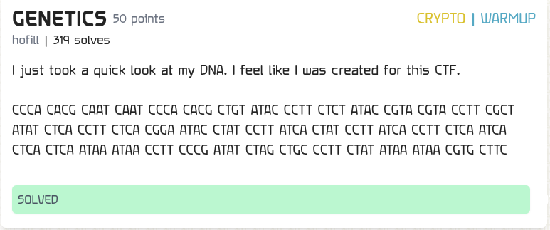

This challenge was easy after finding out what the trick behind the encoding is



After pasting the text to chatgpt, it said to me that it was in the form of DNA encoding

Then I started to search about DNA encoding like ctf writeups and some conversion after going through alot of websites and blogs I found a github repo which showed me how the enconding was done

The proccess goes like this

1. First you enter the string you want to encode

2. The string is converted into binary

3. And then the binary is converted using DNA encoding

```
A = 00
T = 01
G = 10
C = 11
```

With this I was able to write a script which decodes the DNA to binary then I paste that output into cyberchef and got the flag

The flag is TFCCTF{1_w1ll_g3t_th1s_4s_4_t4tt00_V3ry_s00n}
